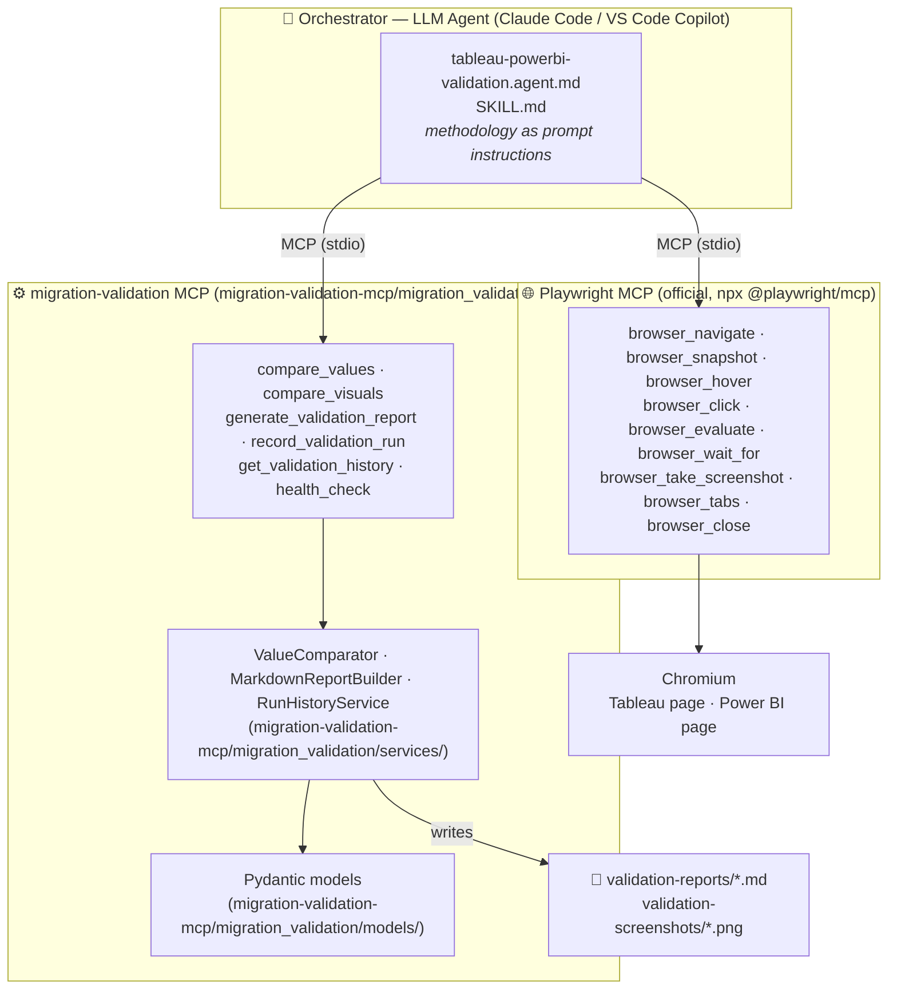
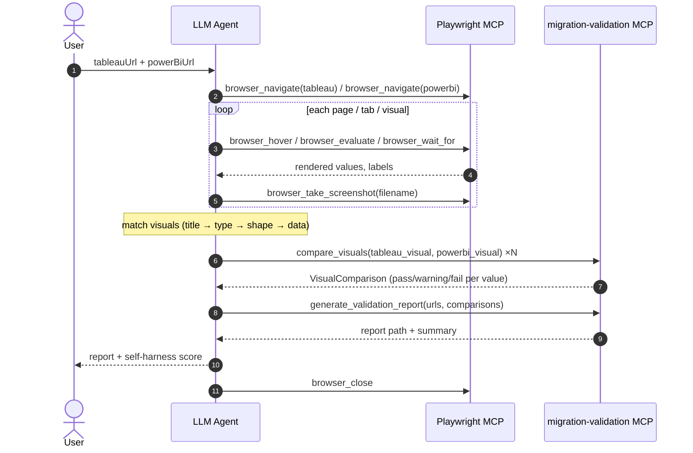

# Migration Validation Agent — High-Level Design (HLD)

Validates **Tableau → Power BI** dashboard migrations by comparing what is *visibly
rendered in the browser* on both platforms — not the underlying data model, DAX, or SQL.
A business user sees pixels; this tool checks that the pixels agree.

The system has three cooperating layers:

| Layer | What it is | Where it lives |
|-------|-----------|----------------|
| **Orchestrator** | An LLM agent that reads a playbook and decides *what to do next* | `.github/agents/`, `.claude/skills/` (repo root) |
| **Browser hands** | The **official Playwright MCP server** (`npx @playwright/mcp`) | registered in `.mcp.json` / `.vscode/mcp.json` — no code here |
| **Domain tools** | This Python MCP server: deterministic comparison + report rendering | `migration-validation-mcp/migration_validation/` |

## 1. Component architecture

**Key point:** browser automation is not our code. The agent extracts raw rendered
strings ("$1.2M", "45.3%") via Playwright MCP, then hands them to this server, which
applies the tolerance rules and renders the report — deterministically, every run.

## 2. Runtime flow (end-to-end validation run)

## 3. Comparison rules (migration-validation-mcp/migration_validation/services/comparator.py)

| Value kind | Rule |
|------------|------|
| Numbers (handles `$`, `,`, `K/M/B`, `(…)` negatives) | banded: ≤ `NUMERIC_PASS_PCT` (default 0%) **PASS**, ≤ `NUMERIC_WARNING_PCT` (default 0.5%) **WARNING**, above **FAIL** |
| Percentages | pass if absolute diff ≤ `PERCENTAGE_TOLERANCE_POINTS` (default 1pt) |
| Dates | normalized across common formats, must be the same day |
| Text | case-insensitive, whitespace-collapsed equality |
| Data point in Tableau only | **FAIL** (data lost in migration) |
| Data point in Power BI only | **WARNING** (additional data, not a failure) |

Tolerances are configurable via `.env` (see `migration-validation-mcp/.env.example`).

## 4. Design rules

- **Layering:** `server.py → tools/ → services/ → models/`; lower layers never
  import upward. Services are plain Python (unit-testable, no MCP types).
- **Single source of truth for tool schemas:** `ToolSpec` derives each tool's
  JSON schema from its Pydantic input model — schema, validation, and handler
  signature cannot drift apart.
- **Errors never kill the stdio session:** tool failures are returned to the
  agent as `{"error": ...}` so it can retry or work around them.
- **CI enforces both gates on every push/PR:** `.github/workflows/ci.yml` runs
  `pytest` and `ruff check` — a change that breaks tests or lint fails the
  build before it can be merged.

## 5. Validation coverage

Beyond static visual comparison, the playbook exercises the reports:

- **Filter validation** (Phase 4B): applies matching slicer/filter values on
  both platforms (max 5 filters × 2 values, one at a time), re-reads the
  affected KPIs, and compares via `compare_values`.
- **Drill-through validation** (Phase 4C): drills one representative path one
  level down on both platforms, checks children sum to the parent and match
  child-by-child.
- **Run history**: every run is appended to `harness-log.json` via
  `record_validation_run`; `get_validation_history` returns cumulative stats
  (average pass rate, most common failed harness check) — the seed for an
  executive rollup dashboard.

## 6. Known gaps / roadmap

- **Visual matching** (title similarity search across tabs) still happens in the
  LLM; a `match_visuals` tool could make it deterministic too.
- **Structured extraction:** the JS snippets for table scrolling and pie-tooltip
  sweeps still live in the playbook markdown.
- **Auth:** `migration-validation-mcp/scripts/authenticate.py` captures a session
  and the shared MCP configs pass it via `--storage-state` automatically (through
  `migration-validation-mcp/scripts/run_playwright_mcp.py`, which writes an empty
  placeholder when no session exists so fresh clones still start). Remaining
  gap: a session that expires *mid-run* still needs the user to approve MFA
  on their phone — the playbook's Authentication Gate bounds that wait and
  surfaces the approval number instead of stalling.
- **Export/API reconciliation & deep root-cause analysis** (row counts, totals,
  semantic-model inspection via Tableau REST / Power BI XMLA) is deliberately
  out of scope while the "browser-rendered only" rule stands; if adopted, build
  it as a second validation mode, not into this agent.
- **Playbook duplication:** `.claude/skills/tableau-powerbi-validation/SKILL.md`
  and `.github/agents/tableau-powerbi-validation.agent.md` encode the same
  methodology for two different hosts and are hand-synced — every phase change
  has to be edited in both files, with no automated check that they haven't
  drifted. A single source-of-truth body + a small generator (stamping out each
  host's frontmatter) plus a CI diff-check would remove this risk; not yet built.

## References

- Playwright MCP: <https://github.com/microsoft/playwright-mcp>
- VS Code custom agents: <https://code.visualstudio.com/docs/agent-customization/custom-agents>
- Agent playbook: [`.github/agents/tableau-powerbi-validation.agent.md`](.github/agents/tableau-powerbi-validation.agent.md)
