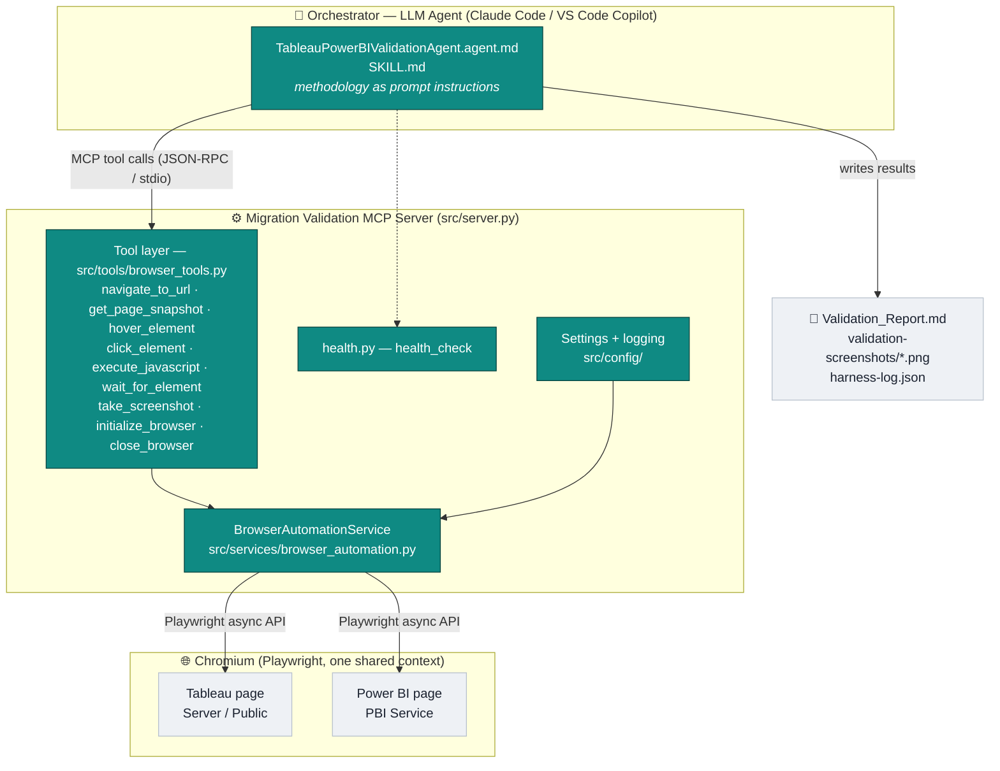
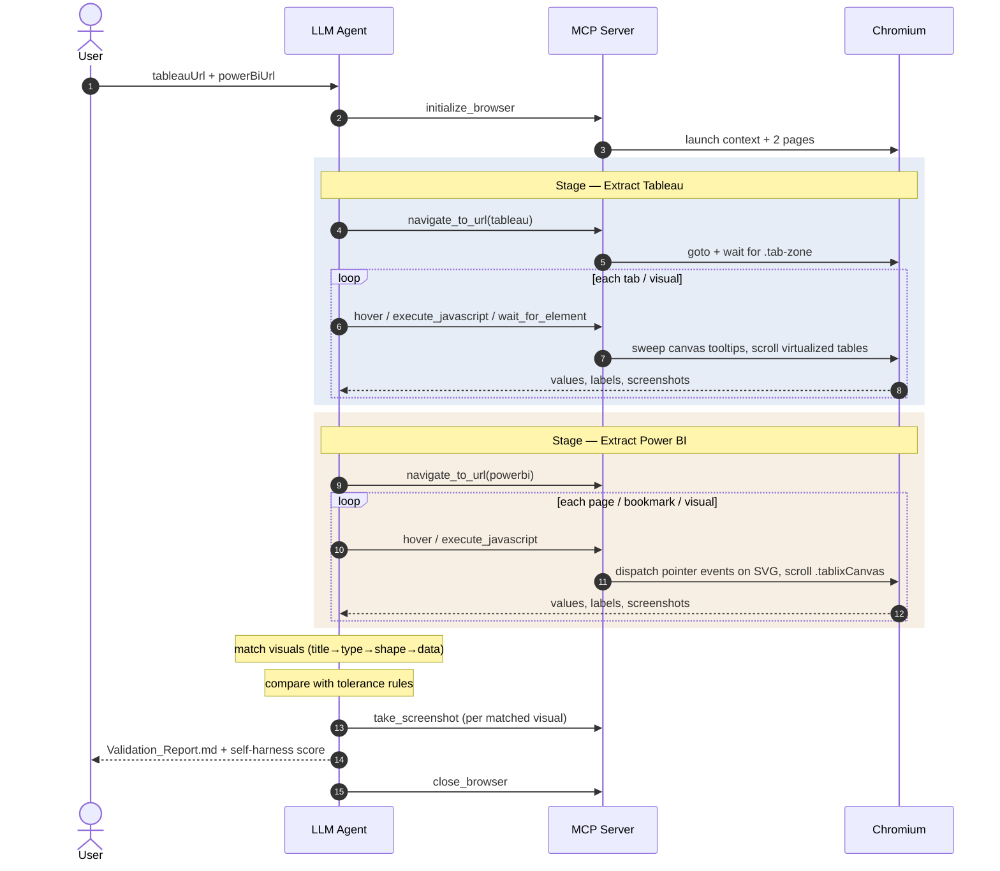
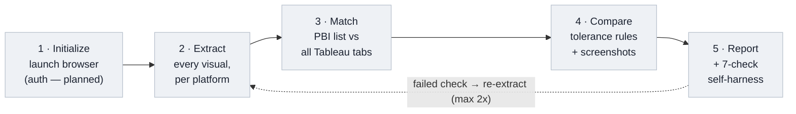

# Migration Validation Agent — Technical Architecture

Validates **Tableau → Power BI** dashboard migrations by comparing what is *visibly
rendered in the browser* on both platforms — not the underlying data model, DAX, or SQL.
A business user sees pixels; this tool checks that the pixels agree.

The system has two cooperating layers:

| Layer | What it is | Where it lives |
|-------|-----------|----------------|
| **Orchestrator** | An LLM agent that reads a playbook and decides *what to do next* | `src/agents/*.agent.md`, `src/agents/SKILL.md` |
| **Tool server** | A deterministic MCP server that gives the agent "hands" in a real browser | `src/server.py`, `src/tools/`, `src/services/` |

The playbook is authored as a [VS Code custom agent](https://code.visualstudio.com/docs/agent-customization/custom-agents),
and the browser primitives mirror [Playwright's MCP tools](https://playwright.dev/python/docs/getting-started-mcp#core-features).

---

## 1. Component architecture

**Key point:** the MCP server is domain-agnostic — it only knows *navigate / click /
hover / screenshot / eval-JS*. All knowledge of "what a visual is" and "how to compare
Tableau to Power BI" lives in the agent playbook, which the LLM executes one tool call at
a time.

---

## 2. Runtime flow (end-to-end validation run)

---

## 3. The validation pipeline (5 stages)

| Stage | What happens | Hardest part |
|-------|--------------|--------------|
| **1 · Initialize** | Launch Chromium, one page per platform | Auth to non-public reports (settings exist, unused) |
| **2 · Extract** | Walk every page/tab/bookmark; pull title, type, axes, legend, **values via hover**, **all rows via scroll** | Canvas/SVG charts expose data only on hover; tables virtualize to ~20 rows |
| **3 · Match** | Power BI is the master list; search *all* Tableau tabs by title → type+field → shape → data | A visual may live on any Tableau tab, not a same-named one |
| **4 · Compare** | Per-type tolerance: numbers ≤1%, percentages ≤1pt, text case-insensitive, dates normalized; capture screenshots | Extra rows/cols reported as *additional*, not failures |
| **5 · Report** | Write `Validation_Report.md`, run a 7-check self-harness, log score to `harness-log.json` | Failing checks trigger up to 2 automated re-extractions |

---

## 4. Tool inventory

### Built today (`src/tools/browser_tools.py`)

| Tool | Purpose |
|------|---------|
| `initialize_browser` | Launch Chromium and prepare context |
| `navigate_to_url` | Open a Tableau/Power BI report and wait for load |
| `get_page_snapshot` | Accessibility-tree snapshot of the page |
| `hover_element` | Hover to reveal a tooltip |
| `click_element` | Click a tab, filter, or bookmark |
| `execute_javascript` | Run arbitrary JS in page context (the workhorse for extraction) |
| `wait_for_element` | Wait for a selector to become visible |
| `take_screenshot` | Full-page PNG into `validation-screenshots/` |
| `close_browser` | Tear down browser and free resources |
| `health_check` | Server liveness probe |

### Proposed — would move logic out of the playbook and into the server

Today, table-scrolling, pie-tooltip sweeps, and visual-count auditing exist only as
JavaScript snippets *inside the markdown* that the LLM re-derives every run. Promoting
them to real MCP tools makes them deterministic and far cheaper in tokens:

`list_visual_containers` · `extract_table_rows` · `sweep_pie_tooltips` ·
`match_visuals` · `compare_values` · `generate_report`

---

## 5. Fixes applied in this pass

| Area | Before | After |
|------|--------|-------|
| **Screenshot capture** | `_take_screenshot()` was a *sync* method calling async `page.screenshot()` without `await` — the coroutine was discarded and **no PNG was ever written**. It also screenshotted the first available page, not the requested one. | Replaced with `async _capture_screenshot(page, name)` that awaits the correct page. Verified: real PNGs now land in `validation-screenshots/`. |
| **Tooltip extraction** | `hover()` called `page.query_selector()` without `await`, so `tooltip` was a coroutine — the `if tooltip:` was always truthy and the read silently failed inside a bare `except:`. | Awaited the selector; narrowed to `except Exception`. |
| **Entry point** | `main.py` was the untouched `uv init` placeholder ("Hello from…"); nothing launched `src/server.py`. | `main.py` now calls `src.server.run()`; added a sync `run()` wrapper and a `[project.scripts]` entry so `uv run migration-validation-mcp` starts the server. |
| **Smoke test** | `test_browser_navigation.py` called the service with `platform=` / `page_name=` / `visual_id=` — kwargs that no longer exist; it crashed immediately. | Updated to the current `page_type=` / `name=` API. |

---

## 6. Known gaps / roadmap

- **Authentication** — `TABLEAU_PAT_*` and `POWERBI_CLIENT_*` live in `src/config/settings.py`
  but nothing reads them; only public / pre-authenticated reports work today.
- **Tool-name reconciliation** — the playbook is written against Playwright-MCP tool names
  (`browser_navigate`, `browser_snapshot`, …) while this server exposes its own
  (`navigate_to_url`, `get_page_snapshot`, …). Pick one surface: adopt Playwright MCP
  directly, alias our tools to its names, or point the agent at our tools.
- **Structured results** — `src/models/` is empty; tool responses are raw dicts. Pydantic
  models would let the agent's output (visual inventory, variance table) be validated
  rather than trusted as free-form Markdown.
- **Move extraction into tools** — see §4; reduces prompt size and run-to-run variance.
- **Tests** — `pytest`/`pytest-asyncio` are dev deps but there is no test suite yet;
  `test_browser_navigation.py` is a manual script, not a pytest module.

---

## References

- Playwright MCP — core features: <https://playwright.dev/python/docs/getting-started-mcp#core-features>
- VS Code custom agents: <https://code.visualstudio.com/docs/agent-customization/custom-agents>
- Agent playbook: [`src/agents/TableauPowerBIValidationAgent.agent.md`](src/agents/TableauPowerBIValidationAgent.agent.md)
- Skill spec: [`src/agents/SKILL.md`](src/agents/SKILL.md)
