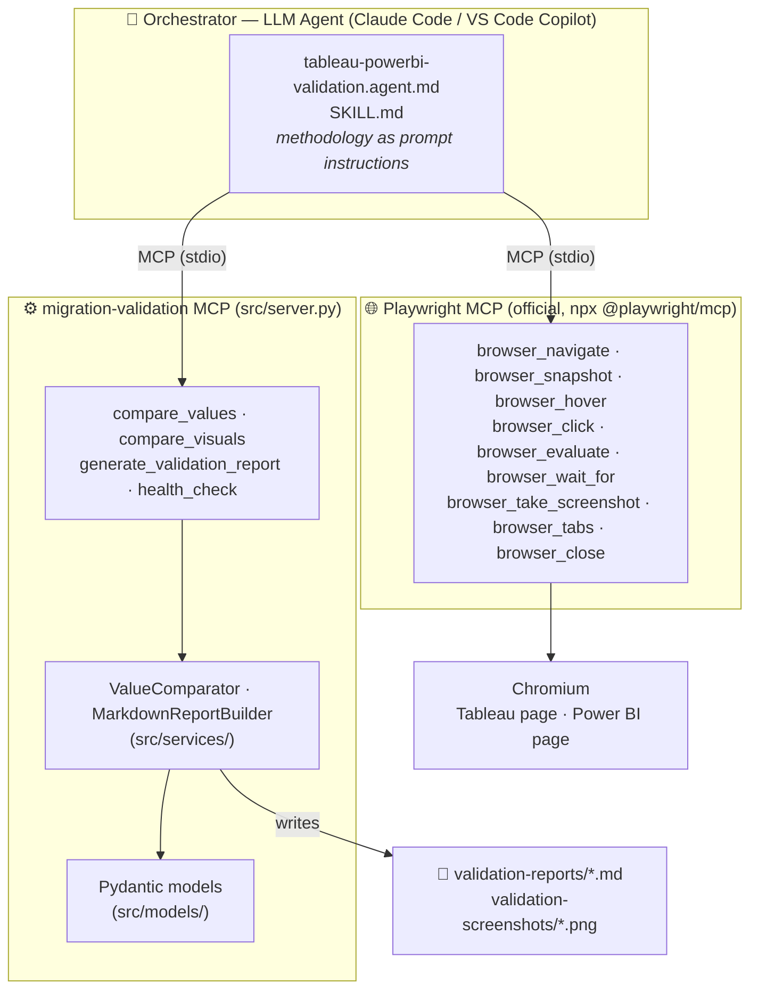
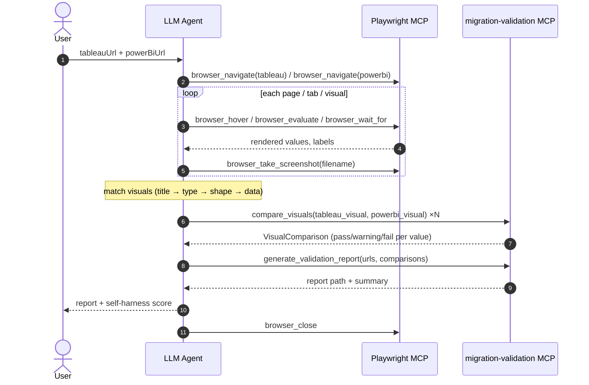

# Migration Validation Agent — Technical Architecture

Validates **Tableau → Power BI** dashboard migrations by comparing what is *visibly
rendered in the browser* on both platforms — not the underlying data model, DAX, or SQL.
A business user sees pixels; this tool checks that the pixels agree.

The system has three cooperating layers:

| Layer | What it is | Where it lives |
|-------|-----------|----------------|
| **Orchestrator** | An LLM agent that reads a playbook and decides *what to do next* | `.github/agents/`, `.claude/skills/` (repo root) |
| **Browser hands** | The **official Playwright MCP server** (`npx @playwright/mcp`) | registered in `.mcp.json` / `.vscode/mcp.json` — no code here |
| **Domain tools** | This Python MCP server: deterministic comparison + report rendering | `src/` |

## 1. Component architecture

**Key point:** browser automation is not our code. The agent extracts raw rendered
strings ("$1.2M", "45.3%") via Playwright MCP, then hands them to this server, which
applies the tolerance rules and renders the report — deterministically, every run.

## 2. Runtime flow (end-to-end validation run)

## 3. Comparison rules (src/services/comparator.py)

| Value kind | Rule |
|------------|------|
| Numbers (handles `$`, `,`, `K/M/B`, `(…)` negatives) | pass if relative diff ≤ `NUMERIC_TOLERANCE_PCT` (default 1%) |
| Percentages | pass if absolute diff ≤ `PERCENTAGE_TOLERANCE_POINTS` (default 1pt) |
| Dates | normalized across common formats, must be the same day |
| Text | case-insensitive, whitespace-collapsed equality |
| Data point in Tableau only | **FAIL** (data lost in migration) |
| Data point in Power BI only | **WARNING** (additional data, not a failure) |

Tolerances are configurable via `.env` (see `.env.example`).

## 4. Design rules

- **Layering:** `server.py → tools/ → services/ → models/`; lower layers never
  import upward. Services are plain Python (unit-testable, no MCP types).
- **Single source of truth for tool schemas:** `ToolSpec` derives each tool's
  JSON schema from its Pydantic input model — schema, validation, and handler
  signature cannot drift apart.
- **Errors never kill the stdio session:** tool failures are returned to the
  agent as `{"error": ...}` so it can retry or work around them.

## 5. Known gaps / roadmap

- **Visual matching** (title similarity search across tabs) still happens in the
  LLM; a `match_visuals` tool could make it deterministic too.
- **Structured extraction:** the JS snippets for table scrolling and pie-tooltip
  sweeps still live in the playbook markdown.
- **Auth:** `scripts/authenticate.py` captures a session; wiring
  `--storage-state` into `.mcp.json` is a manual step today.

## References

- Playwright MCP: <https://github.com/microsoft/playwright-mcp>
- VS Code custom agents: <https://code.visualstudio.com/docs/agent-customization/custom-agents>
- Agent playbook: [`../.github/agents/tableau-powerbi-validation.agent.md`](../.github/agents/tableau-powerbi-validation.agent.md)
